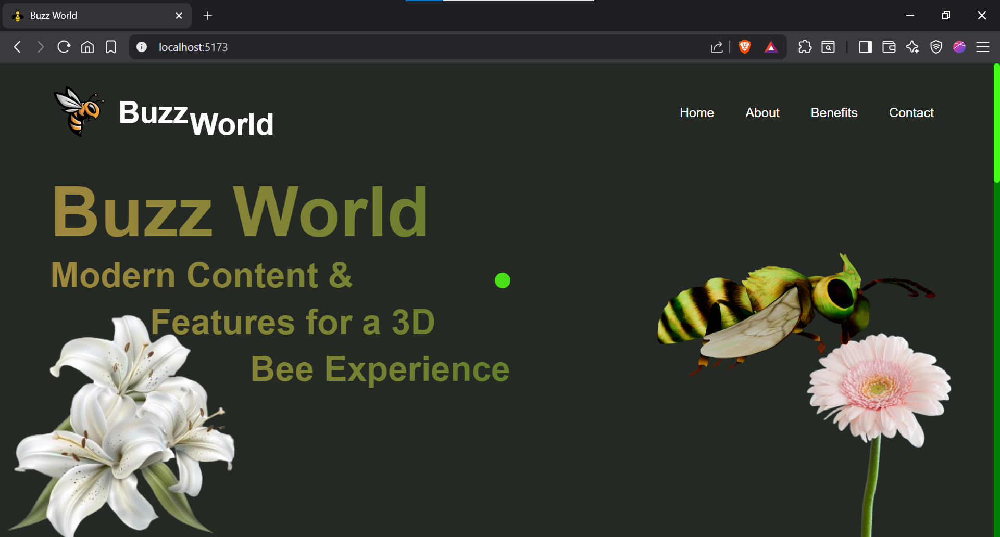
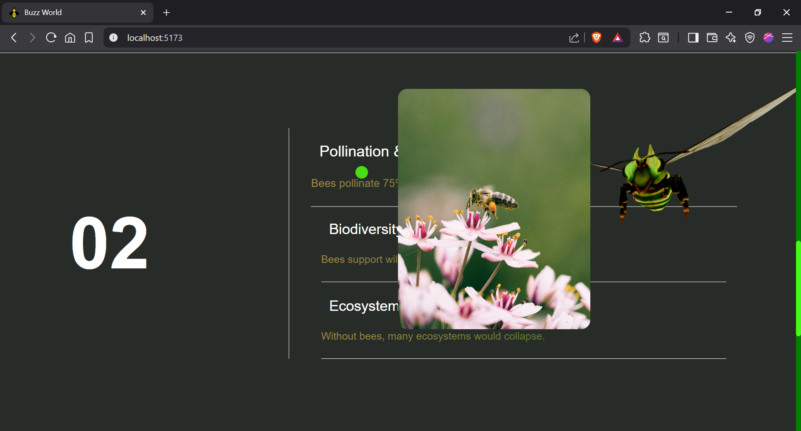
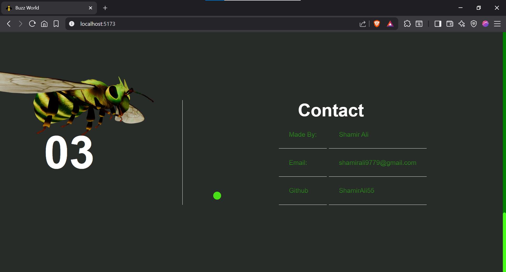

# 🐝 BuzzWorld

**BuzzWorld** is an immersive 3D interactive experience built using Three.js and GSAP. This project visualizes a buzzing bee in a stylized digital world with smooth animations, scroll effects, and custom assets.

---

## 📦 Folder Structure

```

BuzzWorld/
│
├── assets/
│   └── model/
│       └── scene.glb              # Bee 3D model
│
├── node\_modules/
│
├── src/
│   ├── bee\_logo.png
│   ├── lily.png
│   ├── right\_flower.png
│   └── style.css
│
├── .gitignore
├── index.html                     # Main HTML entry
├── main.js                        # Main JavaScript + logic
├── package.json
├── package-lock.json
└── README.md

````

---

## 🎯 Features

- 🐝 Integrated GLB bee model using `GLTFLoader`
- 🌼 Animated flowers and logo
- ✨ Smooth transitions via [GSAP](https://greensock.com/gsap/)
- 🎨 Custom cursor, loader animation, and gradient text
- 🧭 Three major sections:
  - **About the Bee**
  - **Environment**
  - **Content (Random Facts)**

---

## 🔧 Built With

- [Three.js](https://threejs.org/)
- [GSAP](https://greensock.com/)
- HTML5, CSS3, JavaScript (ES6)
- Local asset rendering (no CDN dependency)

---

## 📸 Screenshots

> Below are sample static visuals of the experience.








---

## 🚀 How to Run

1. Clone the repository:
   ```bash
   git clone https://github.com/ShamirAli55/BuzzWorld.git
````

2. Install dependencies:

   ```bash
   npm install

3. Run server

  npm run dev

4. Open in browser:

   http://localhost:5173

---

## 👨‍💻 Author

**Shamir Ali**
📧 Email: [shamirali9779@gmail.com](mailto:shamirali9779@gmail.com)
🔗 GitHub: [ShamirAli55](https://github.com/ShamirAli55)

---

## 📜 License

This project is licensed under the [MIT License](LICENSE).

---


---

